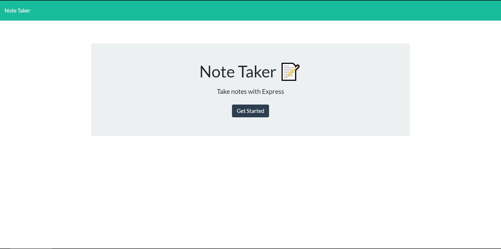

# Note Taker

# Screenshot

# Description

Note taker is an app that allows a user to make and delete notes.

# Link to application

Click [Here](https://notetaker-mf.herokuapp.com/)

# Questions

If you have any questions, you can reach me using these methods.

Github: [github](https://github.com/campe0n)

Email: melvinrf@Outlook.com

# License

This project is licensed by MIT
